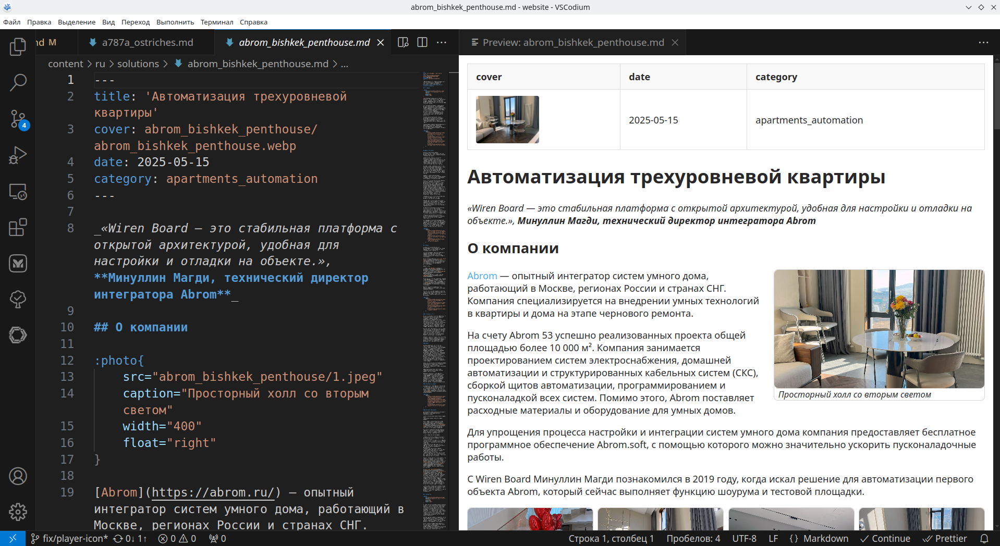

# vscode-mdx-preview-wb-style
## Описание
Кастомный рендер md-файлов из репозитория https://github.com/wirenboard/website

Основная идея — находить в тексте [компоненты](https://github.com/wirenboard/website/blob/main/doc/components.md) и рендерить их в html, по пути подтягивая файлы картинок.

Пока умеет только photo и gallery.




## Сборка
### Установка зависимостей (однократно)
```
sudo npm install -g vsce
```

В каталоге проекта:
```
npm install
```

### Компиляция TypeScript и упаковка в .vsix
```
npm run package
```
Собранный плагин будет в папке `dist`.

# Как пользоваться
## Установка или обновление расширения в VSCodium
```
codium --install-extension ./dist/mdx-preview-X.Y.Z.vsix --force
vscode --install-extension ./dist/mdx-preview-X.Y.Z.vsix --force
```

## Запуск предпросмотра в редакторе (вручную)

Ctrl+Shift+P → Mdx Preview: Show Preview

## Добавления своего рендера

### 1. Компонент в MDX  

Пусть у вас в файле такой компонент:
```md
:myComponent{
  data='[
    {"name":"Item One","value":42},
    {"name":"Item Two","value":99}
  ]'
}
```

### 2. Шаблон  
Для отрисовки создадим шаблон `templates/myComponent.html`:
```hbs
<div class="mdx-my-component">
{{#each items}}
<article class="my-component-item">
  <h3>{{name}}</h3>
  <p>Value: {{value}}</p>
</article>
{{/each}}
</div>
```

### 3. Реализация 
Добавим парсер в `extension.ts`:
```ts
import * as vscode from 'vscode';
import myTpl from './templates/myComponent.html';

renderers.myComponent = (attrs, webview, docUri) => {
  // 1. Парсим JSON в массив объектов с полями name и value
  const raw = JSON.parse(attrs.data || '[]') as Array<{ name: string; value: number }>;
  // 2. Подготавливаем контекст для шаблона
  const items = raw.map(item => ({
    name: item.name,
    value: item.value
  }));
  // 3. Передаём в общий renderTemplate
  return renderTemplate(myTpl, { items });
};
```

## 4. Стили
Теперь стилизуем в `media/styles.css`:  
```css
.mdx-my-component {
  display: flex;
  flex-direction: column;
  gap: 1em;
}
.my-component-item {
  border: 1px solid #ddd;
  padding: 0.5em;
  border-radius: 4px;
}
.my-component-item h3 {
  margin: 0 0 0.5em;
}
```

## Если есть картинки

Если внутри компонента есть картинки, надо преобразовать пути:
```ts
const webviewUri = resolveRelativePath(webview, documentUri, relativePath)
```